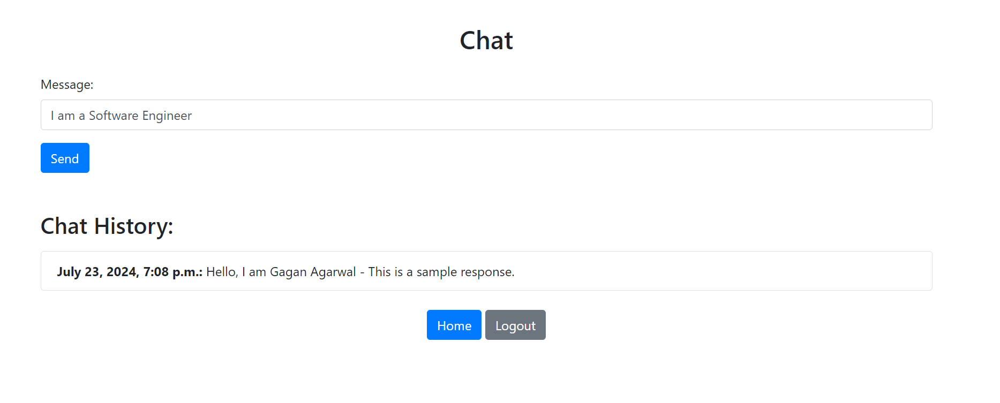

# Chatbot

This project is a web-based chat with AI application built with Django. It provides user authentication, chat functionality with AI, and token management. Users can log in, sign up, and engage in chat conversations with Ai while managing their tokens. The system ensures that users have a minimum number of tokens to send messages and deducts tokens per message. Here you can connect this API with any AI based chat API to chat. As a default i pass a sample response in it.

## Table of Contents

- [Images](#images)
- [Features](#features)
- [Installation](#installation)
- [Usage](#usage)
- [Technologies Used](#technologies-used)
- [Contributing](#contributing)

## Images
- Signup

-Login

-Home

-Chats

## Features

- **User Registration and Authentication**: Users can create an account, log in, and log out.
- **Chat Functionality**: Users can send and receive messages. Each message deducts 100 tokens from the user's account.
- **Token Management**: Users start with 4000 tokens and need at least 100 tokens to send a message.
- **Chat History**: View past chat messages in chronological order.
- **Admin Interface**: Manage users and chat records through Django's admin panel.

## Installation

1. **Create a virtual environment:**

   ```bash
   python -m venv env
   source env/bin/activate  # On Windows use `env\Scripts\activate`

2. **Install dependencies:**

   ```bash
   pip install -r requirements.txt


3. **Apply database migrations:**

   ```bash
   python manage.py migrate

4. **Create a superuser:**

   ```bash
   python manage.py createsuperuser

5. **Run the development server:**

   ```bash
   python manage.py runserver

6. **Access the application at http://localhost:8000.**

# Usage
- Register a New User: Navigate to /signup/ and fill out the registration form. (Password is required)
- Login: Navigate to / and log in with your registered credentials.
- Chat: Once logged in, navigate to /chat/ to send and view chat messages. You need at least 100 tokens to send a message, and each message deducts 100 tokens from your account.
- Home Page: Access user information and manage tokens at /home/.
- Logout: Navigate to /logout/ to end your session.

# Technologies Used
- Django
- HTML/CSS
- Bootstrap
- SQLite (default database used by Django)
